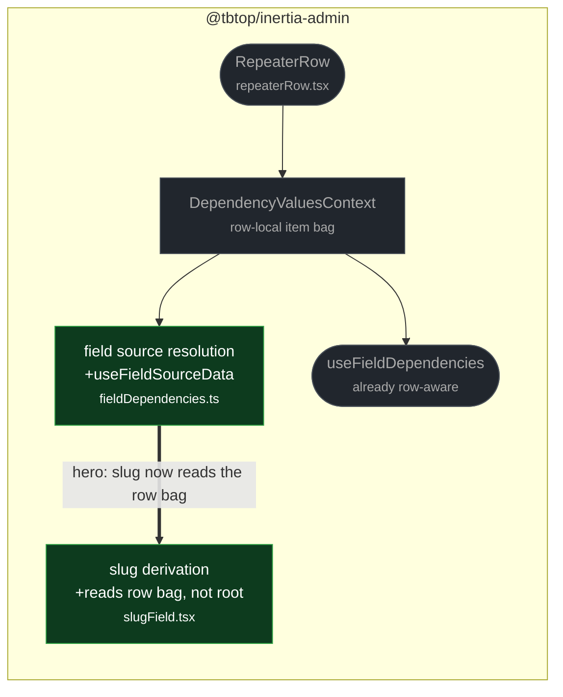

# fix(fields): resolve slug sources against the repeater row

touches: slug field, field dependencies

A slug sub-field inside a repeater row derived its value from the **root** form's
source field instead of its own row's. Two rows with different titles produced the
same slug. `SlugForm` called `useNearestFormController()` directly, which always
returns the single root form controller, bypassing the row-scoped
`DependencyValuesContext` that `RepeaterRow` already provides.

`useFieldSourceData()` mirrors what `useFieldDependencies` already did: prefer
`DependencyValuesContext` when present, fall back to the nearest controller. No
wire-contract, PHP, or DSL surface is touched.

Intent says the finding covered both `dependsOn` and slug; the diff shows only the
slug half changed — `dependsOn` was already row-aware on the base commit, so the
patch is narrower than its finding, not incomplete.

**Read by eye:**
- `packages/client/src/fields/fieldDependencies.ts`
- `packages/client/src/fields/slugField.tsx`

**Verification:**
- The added test in `repeaterField.test.tsx` was run against the base commit and
  fails there (root title leaks into a row slug), then passes with the patch.
- No-controller case preserved: `useFieldSourceData()` yields `{}`, and
  `sourceAt({}, …)` returns `""`, matching the old `ctrl ? … : ""` guard.
