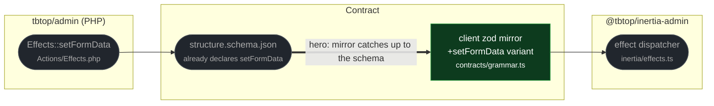

# fix(contracts): teach the client grammar the setFormData effect

touches: wire grammar

> ⚠️ **Contract** `effectSchema`: 7 effect variants → 8, adding
> `{kind: "setFormData", data: Record<string, unknown>}` (`.strict()`).
> Widening only — no existing variant changed, so nothing that parsed before stops parsing.

`setFormData` is a real server effect: PHP builds it, the authoritative JSON schema
declares it, and the client dispatcher applies it. Only the hand-maintained zod
mirror in the client lacked the variant, so validating a descriptor through the
client grammar rejected an effect the runtime happily executes.

This closes drift rather than creating it: PHP, the JSON schema, and the PHP
contract test already agreed with each other before this change.

`.strict()` on the new variant mirrors `additionalProperties: false` in the JSON
schema for this effect. Sibling zod variants are looser than their schema
counterparts — pre-existing looseness in a mirror the file's own header calls
partial, not something this change introduces.

**Read by eye:**
- `packages/client/contracts/grammar.ts`

**Assumptions:**
- `CLAUDE.md`'s "closed effect set" list is stale — it omits both `copyToClipboard`
  and `setFormData`, which are implemented on both sides. Worth correcting in a
  separate docs pass; not done here to keep this change to the reviewed diff.
