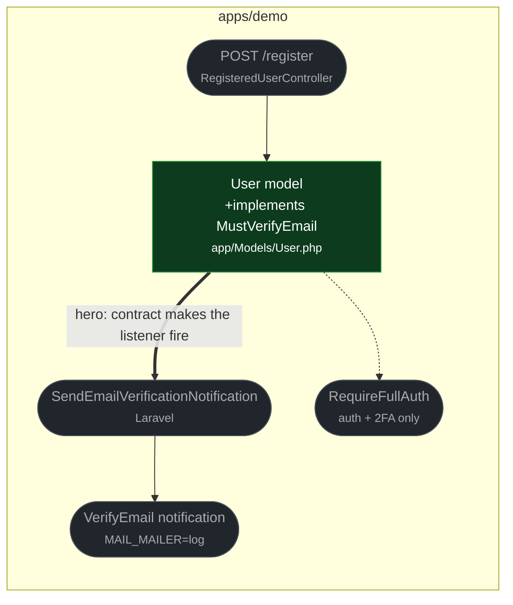

# fix(auth): declare the demo User as MustVerifyEmail

touches: demo user account

> ⚠️ **Auth** `App\Models\User` now implements `Illuminate\Contracts\Auth\MustVerifyEmail`.
> Registration starts dispatching the `VerifyEmail` notification. No route gains an
> access gate — see the radius note below.

The demo `User` inherited Laravel's verification helper methods but never declared
the contract. Laravel's `SendEmailVerificationNotification` listener checks
`$user instanceof MustVerifyEmail`, so registration silently sent no verification
mail even though the app ships a `VerifyEmailController` and a verification route.

**Radius checked, because this contract usually gates access:** no route or
middleware in the demo uses Laravel's `verified` middleware. Admin and settings sit
behind `RequireFullAuth`, which checks only session presence and 2FA. Seeded users
(`DatabaseSeeder` uses `updateOrCreate`, bypassing the factory default) therefore
have a NULL `email_verified_at` and are still admitted. The contract only flips a
`mustVerifyEmail` flag surfaced to the settings screens.

**Read by eye:**
- `apps/demo/app/Models/User.php`

**Verification:**
- `vendor/bin/pest tests/Feature/Auth` → 34 passed.
- Full demo suite run on this branch and on the merge-base: **14 failed / 107 passed
  on both**, identical set — pre-existing storage/media setup failures in a fresh
  worktree, unrelated to this change.
- The added assertion is red on base: without the contract the listener no-ops and
  `assertSentTo(…, VerifyEmail::class)` fails.
