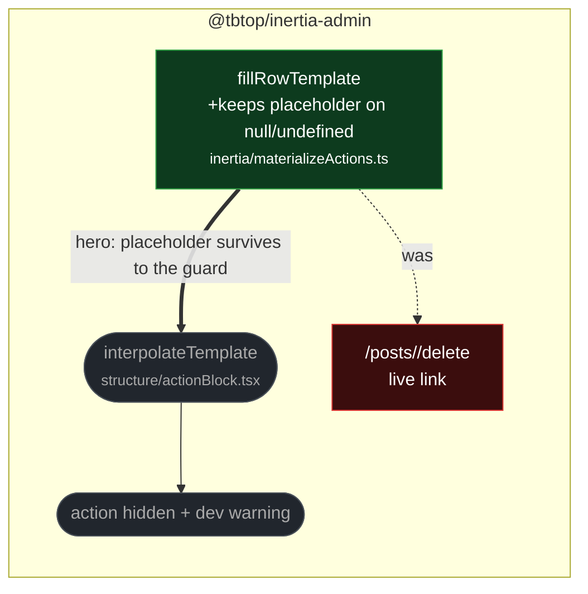

# fix(actions): keep unresolved row placeholders so the action stays hidden

touches: action materialization, visit-template interpolation

A serialized row action such as `/posts/{row.id}/delete` whose row value was
missing had its placeholder replaced with an empty string, producing a live,
clickable link to `/posts//delete`. Depending on server-side route normalization
that can reach a different endpoint than intended. `fillRowTemplate` now leaves the
placeholder in place, which the renderer's existing guard rejects — the action is
hidden, matching what the direct (non-serialized) action path already did.

The two action paths now agree: both hide the action when a row value is missing.

**How the guard catches it:** `interpolateTemplate`'s `PLACEHOLDER_RE` is
`/\{([^}]+)\}/g`, so it captures the whole `row.id` span as the lookup key. A row
object never has a literal `"row.id"` property, so the lookup is always `undefined`
and the function returns `null`. No URL encoding runs between the two functions, so
the braces reach the regex intact.

That parity is real but incidental — it depends on the regex staying permissive and
on `fillRowTemplate` keeping the `row.` prefix. The patch shipped only string-shape
assertions, so a follow-up commit on this branch adds a regression test at the
`ActionBlock` seam asserting the hidden-action outcome itself.

**Read by eye:**
- `packages/client/src/inertia/materializeActions.ts`
- `packages/client/src/structure/visitTemplate.test.tsx` (added test)

**Verification:**
- Added test verified red against the pre-fix empty substitution and green with the
  fix, driving `materialize()` → `RowProvider` → `ActionBlock` rather than the
  helper in isolation.
- `materializeActions.test.ts` 14 pass, `actionBlock.test.tsx` 15 pass,
  `visitTemplate.test.tsx` 7 pass.
