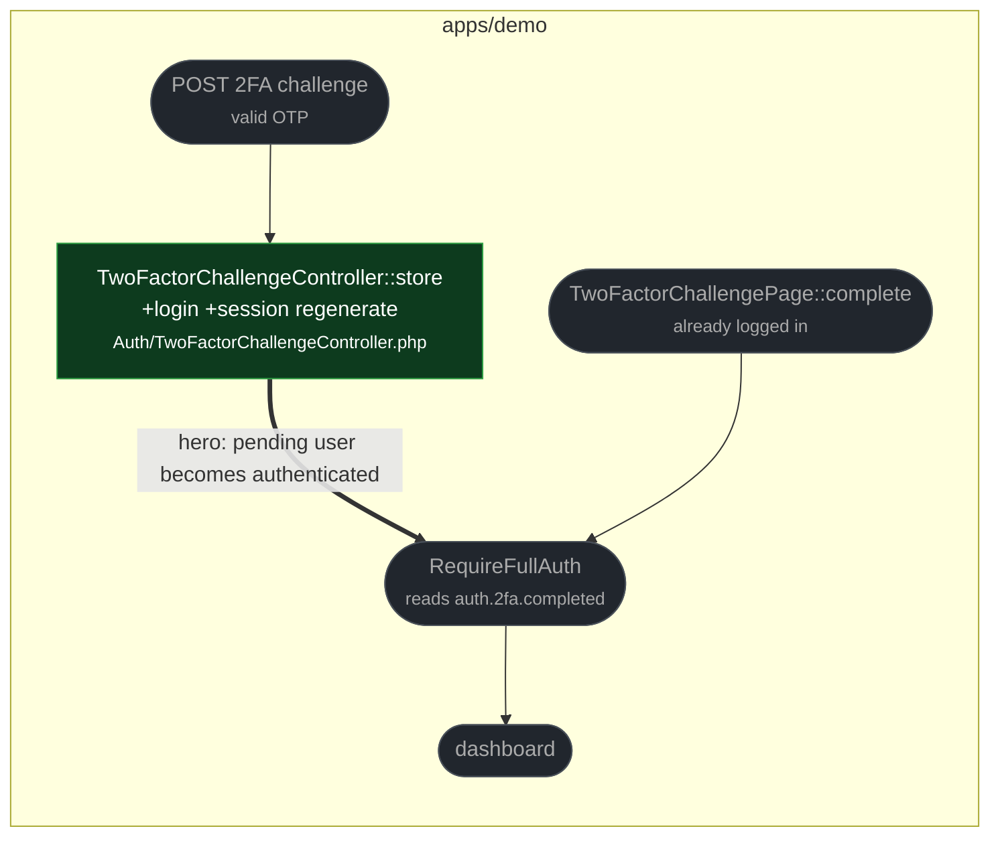

# fix(auth): log the pending user in when the 2FA challenge succeeds

touches: two-factor challenge

> ⚠️ **Auth** `TwoFactorChallengeController::store` now calls
> `Auth::guard('web')->login($user)` and regenerates the session on a valid OTP.
> Strictly more authentication than before, not less — the endpoint already
> required a verified OTP to reach this point.

A correct OTP cleared the pending user id and set `auth.2fa.completed`, but never
authenticated anyone. The visitor was redirected to the dashboard as a guest and
bounced by the auth middleware. The DSL challenge page did this correctly; only the
standard controller path was broken.

The session is regenerated after login, which is the fixation-safe order.

**Ordering note:** this path does `login → forget → regenerate → put`, while the DSL
page does `login → forget → put → regenerate`. `Illuminate\Session\Store::regenerate()`
only swaps the id and CSRF token — it migrates attributes rather than clearing them —
so both orders leave the same session state. Worth converging one day for readability,
not a defect.

**Read by eye:**
- `apps/demo/app/Http/Controllers/Auth/TwoFactorChallengeController.php`

**Verification:**
- `vendor/bin/pest tests/Feature/Auth` on the patch branch → 34 passed, matching base.
- `Auth::guard('web')` matches `config/auth.php`'s default guard and the guard used by
  `AuthenticatedSessionController`.
- Added assertions are red on base: with no `login()` call, `assertAuthenticatedAs`
  fails there.
