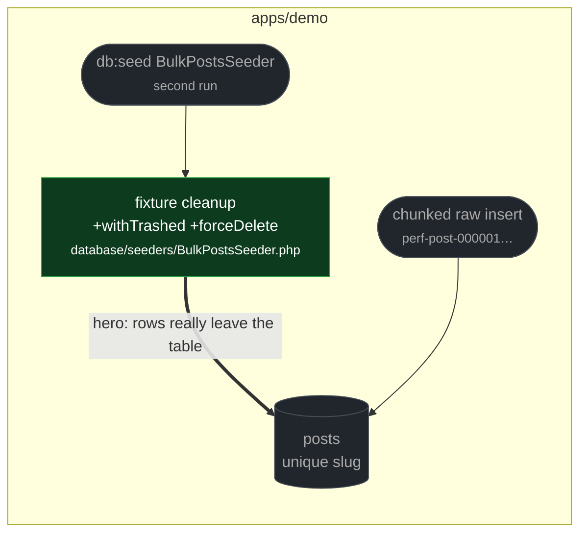

# fix(demo): force-delete bulk fixture posts so reseeding stays idempotent

touches: bulk post seeding

`Post` uses `SoftDeletes`, so the seeder's `delete()` only stamped `deleted_at` on
the previous `perf-post-%` rows. Their unique slugs stayed in the table, and the
next raw insert collided on `perf-post-000001`. Re-running the documented seeder
failed outright instead of replacing the dataset.

Scope is the generated `perf-post-%` fixtures only, so no authored content can be
force-deleted by this path.

**Read by eye:**
- `apps/demo/database/seeders/BulkPostsSeeder.php`

**Verification:**
- The pre-existing `BulkPostsSeederTest` idempotency test was run on the merge-base
  and **fails** there (unique slug collision on the second seed), then **passes** on
  this branch. The defect was real and already had a test that nothing was running.

**Assumptions:**
- The finding also suggested wrapping cleanup and insert in a transaction so a failed
  insert cannot leave the dataset empty. The patch does not do this, and it was not
  merged as part of this change — a crash mid-seed still leaves the table cleared.
  Acceptable for a demo fixture seeder; worth a follow-up if the seeder is ever used
  against anything but a scratch database.
