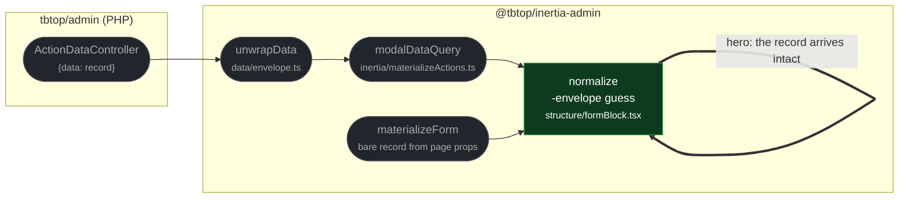

# fix(forms): stop unwrapping records that carry their own data attribute

touches: form record normalization

`normalize()` treated any object with a non-null object-valued `data` property as a
transport envelope and returned that property. A record whose own JSON attribute is
named `data` therefore lost every sibling field: the form controller saw only the
inner object, fields initialised blank, dirty tracking compared against the wrong
record, and a submit could omit the discarded attributes.

**Why removing the unwrap is safe, not a regression:** the only endpoint that emits a
`{data: …}` envelope is `ActionDataController`, and that response is already unwrapped
one layer up by `unwrapData` inside `modalDataQuery` before it ever reaches
`normalize`. The other producer, `materializeForm`, resolves a bare record straight
from Inertia page props. The deleted branch dates to the original scaffold commit,
predating both the envelope endpoint and its dedicated unwrap handler — it was
speculative duplication, and the only payload it ever actually changed was a
legitimate record with a `data` field.

**Read by eye:**
- `packages/client/src/structure/formBlock.tsx`

**Verification:**
- `formBlock.test.tsx` 21 pass / 2 skip / 0 fail; the whole `src/structure/` tree
  565 pass / 3 skip / 0 fail.
- The envelope boundary keeps its own coverage in `data/envelope.test.ts`, untouched
  by this change and still green.

**Assumptions:**
- No consumer application relies on `FormBlock` receiving a hand-built `{data: …}`
  envelope from a custom query. Nothing in this repo does, but a downstream app that
  wrapped its own form query would now see the envelope instead of the record.
