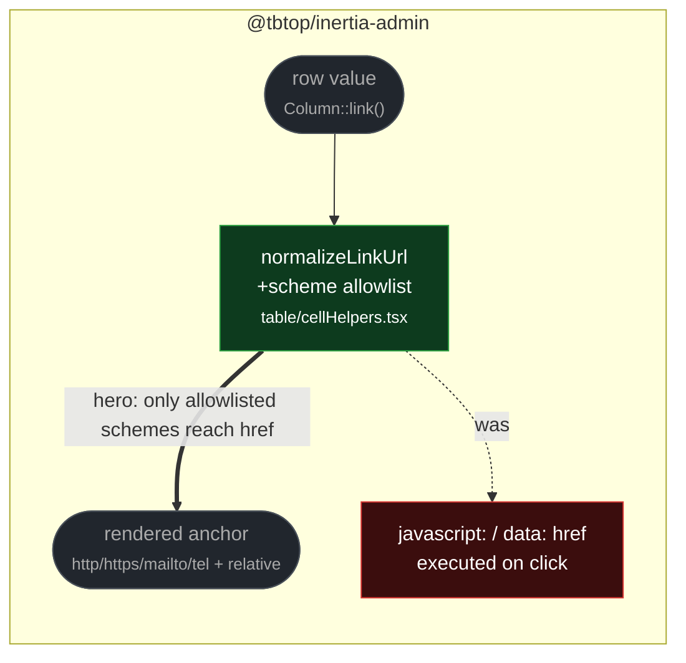

# fix(table): reject unsafe schemes in link cells

touches: table link cell

`LinkCell` placed any non-empty string directly into `href`. A row value carrying
`javascript:` or `data:text/html,…` therefore executed in the admin application's
own origin the moment an operator clicked it — stored XSS with administrator
privileges wherever a link column renders user-supplied data.

Values are parsed with `new URL(value, "https://tabletop.invalid")`, so a relative
path resolves against the dummy base and keeps its `https:` protocol — relative
application URLs still render. Anything outside `http/https/mailto/tel`, and
anything unparseable, renders nothing rather than an inert link.

**Read by eye:**
- `packages/client/src/structure/table/cellHelpers.tsx`

**Verification:**
- Both added cases (`javascript:alert(...)`, `data:text/html,...`) were run against
  the merge-base and **fail** there (the anchor renders), and pass on this branch.
- The full `tableCells.test.tsx` suite is 46 pass / 0 fail on the branch, including
  the pre-existing relative-URL and external-link assertions — no regression to
  ordinary links.

**Assumptions:**
- The dummy base origin `tabletop.invalid` is never user-visible: it only supplies a
  base for parsing, and the original `value` is what reaches `href`. A protocol-
  relative URL (`//evil.com/x`) resolves to `https:` and is therefore still allowed,
  which matches the pre-existing treatment of absolute https links.
