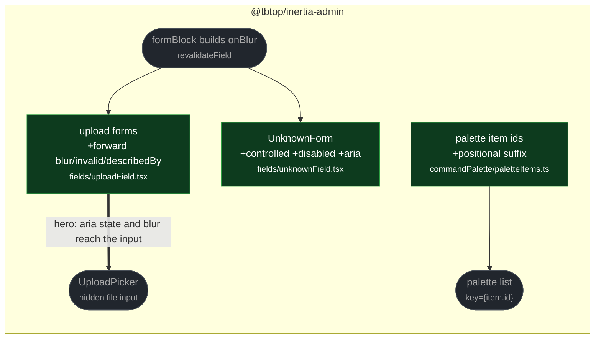

# fix(fields, palette): field contract gaps and duplicate palette ids

touches: upload field, unknown field, command palette

Three findings that each restore a contract the rest of the codebase already keeps.

**Upload pickers ignored the field contract.** `UploadSingleForm` and
`UploadMultiForm` accepted `onBlur`, `invalid` and `describedBy` from
`FieldFormProps` and dropped them, so upload fields never blur-validated and
exposed no `aria-invalid`/`aria-describedby` — unlike every other field.

**`UnknownForm` was uncontrolled.** It used `defaultValue`, so external or
dependency-driven value changes left stale text on screen, and it stayed editable
inside a disabled form.

**Palette item ids were not unique.** Two nav items sharing an href, or two commands
sharing a handler, produced identical ids and therefore duplicate React keys.

**Read by eye:**
- `packages/client/src/fields/uploadField.tsx`
- `packages/client/src/fields/unknownField.tsx`
- `packages/client/src/app/commandPalette/paletteItems.ts`

**Verification:**
- Upload: all three props land on the hidden `<input type="file">`, and the forwarded
  `onBlur` is the same `revalidateField` callback `formBlock` builds for text fields —
  traced, not assumed. Tests assert real DOM attributes and a fired blur event.
- Unknown: both added tests are red on base. The `defaultValue`→`value` switch was
  probed separately for the obvious hazard — a partially typed value such as `{"b"` is
  **not** re-serialized, because `onChange` emits the raw string.
- Palette: `item.id` was grepped repo-wide and is consumed in exactly one place,
  `CommandPalette.tsx` as a React key — no persistence or comparison, so the positional
  suffix costs no stability. The new test asserts set-size equality over real
  duplicate-href and duplicate-handler input.

**Assumptions:**
- Nothing enforces href or handler uniqueness in `NavBuilder`/`Command`, so duplicates
  are a reachable consumer mistake rather than a contrived case.

**Left undone:**
- `UploadPreview` — the populated-value state of an upload field — still does not
  receive `onBlur`/`invalid`/`describedBy`. A filled, invalid upload field therefore
  still won't blur-validate. Same contract, narrower case; not addressed by the merged
  patch and worth a follow-up.
