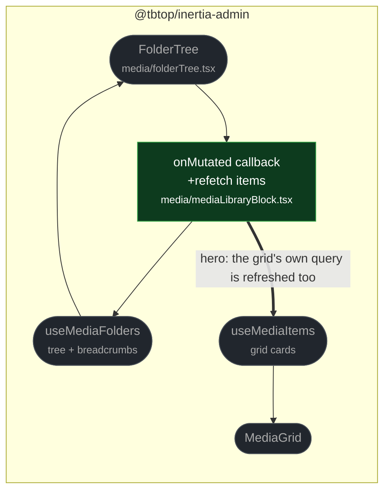

# fix(media): refresh the grid when a folder is mutated

touches: media library

The folder tree and the folder cards inside the grid are fed by two independent
queries — `useMediaFolders` for the tree and breadcrumbs, `useMediaItems` for the
grid. `FolderTree`'s mutation callback refetched only the first, so creating,
renaming, or deleting a folder updated the sidebar while the grid kept showing the
old cards until some unrelated refetch happened to fire.

One added call, no contract or server change. The finding also floated centralising
folder state into a single source; that is a larger refactor and was deliberately not
taken here.

**Read by eye:**
- `packages/client/src/media/mediaLibraryBlock.tsx`

**Verification:**
- The added test was run against the merge-base and **fails** there, then passes on
  this branch. `mediaLibrary.test.tsx` is 22 pass / 0 fail with the fix.
