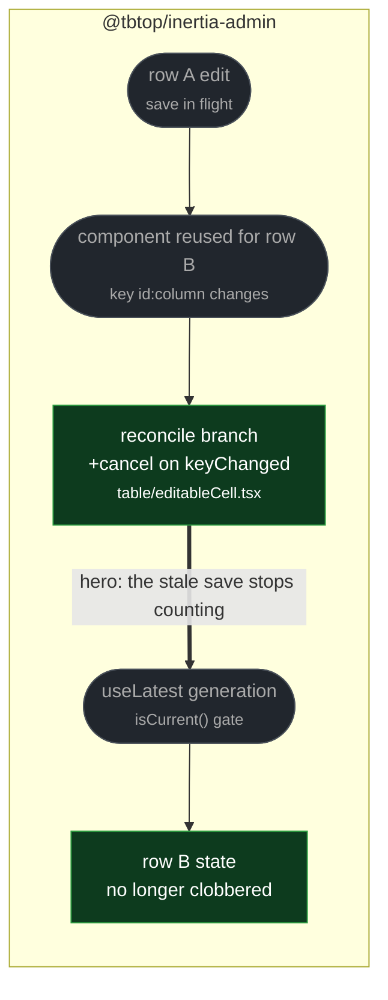

# fix(table): drop a pending cell save when the row is reused

touches: editable table cell

React reuses one `EditableCell` instance as rows scroll or a page changes. A save
already in flight for the old row was never invalidated, so when it settled it wrote
`confirmedValueRef`/`dirtyRef` in the **new** row's context — or, on rejection,
rolled the new row back and displayed the previous row's validation error. Silent
cross-row corruption, since nothing about the UI signals it.

**Why the guard's placement is right, despite looking too narrow.** The `cancel()`
sits nested inside `if (server.changed)`, which reads as though a key change with an
unchanged value would slip past — the dangerous case, since two rows sharing a status
or count is ordinary. It cannot: `useReconciled` computes
`changed = keyChanged || valueChanged`, so `keyChanged` true always implies `changed`
true. And it is the reconciler key (`${id}:${col.name}`), not the value, that flips
on a row change.

`cancel()` bumps the generation rather than aborting the request, but every side
effect — the confirmed-value write, the dirty flag, the rollback, the error display —
lives inside `onResult`/`onError`, both gated by `isCurrent()`. Nothing leaks.

**Read by eye:**
- `packages/client/src/structure/table/editableCell.tsx`

**Verification:**
- The three-line guard was reverted in isolation, keeping the surrounding
  `useLatest`/`useReconciled` machinery intact, and the added test fails; with the
  guard it passes. Genuine red→green rather than a green-on-both assertion.
- The added test drives a real row-id change (3→4) with a save in flight and asserts
  outcomes — no stale error rendered, and the new row shows its own server value.
- `editableCell.test.tsx` 15 pass, `src/lib/` 31 pass.
