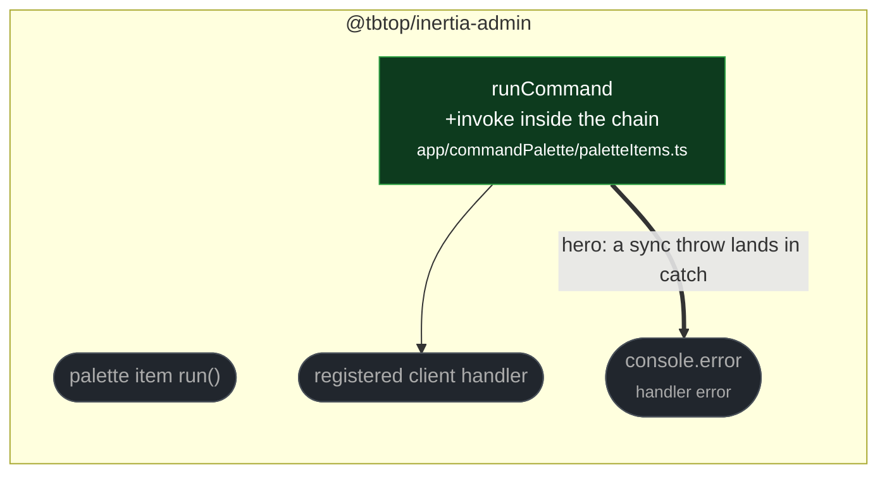

# fix(palette): catch synchronously throwing command handlers

touches: command palette

`Promise.resolve(getPaletteCommand(name)?.())` calls the handler while evaluating
its own argument, so a handler that throws synchronously threw before any `.catch`
existed. The error escaped `run()` into the click handler instead of being logged,
while an async handler rejecting later was caught correctly — the two failure modes
behaved differently for no reason.

Calling the handler inside `.then()` rather than as an argument puts both throw
paths on the same chain. Handlers are now invoked one microtask later; nothing
awaits `run()`, so only test ordering notices, and the existing async test was
extended accordingly.

**Read by eye:**
- `packages/client/src/app/commandPalette/paletteItems.ts`

**Verification:**
- The added test was run against the merge-base and **fails** there — `run()` throws
  out of the call rather than logging — and passes on this branch.
- `src/app/commandPalette/` is 15 pass / 0 fail with the fix, including the
  pre-existing async-rejection test.
