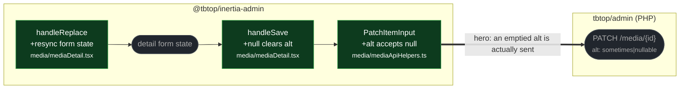

# fix(media): alt clearing and detail resync after replacement

touches: media detail form

Two findings in the same detail pane, merged together because they collide in one
test file.

**Clearing alt never reached the server.** An emptied alt field was serialized as
`undefined`, which JSON drops, so the PATCH carried no `alt` key at all and the
server kept the previous text. It now sends `null` — exactly what the neighbouring
`description` field already did. The endpoint validates `alt` as
`sometimes|nullable|string|max:500` and the column is nullable, so `null` clears it.

**Replacing a file left the form on the old metadata.** `handleReplace` updated the
item but not the local form state, so a subsequent save could write the previous
name, alt, description, tags, and folder back over the replacement.

**Read by eye:**
- `packages/client/src/media/mediaDetail.tsx`
- `packages/client/src/media/mediaApiHelpers.ts` (type widening only)

**Verification:**
- Each branch's added test was run against the merge-base and **fails** there, then
  passes on its branch.
- The two branches conflicted in `mediaLibrary.test.tsx` — git had folded the two new
  tests into a single broken block. Resolved by hand keeping both as separate tests;
  the file now runs **24 pass / 0 fail** (22 before, one test added by each branch),
  and both test names are present.
- Server-side null handling checked against `MediaController.php` validation rules
  rather than assumed.
