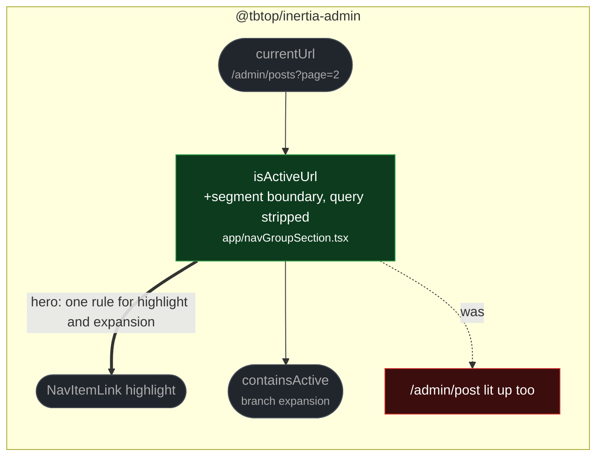

# fix(nav): match active nav items on path segments

touches: sidebar navigation

Active state used raw `currentUrl.startsWith(item.href)` in both the leaf highlight and
the ancestor check. So `/admin/post` was "active" while viewing `/admin/posts`, an item
whose href is `/` matched every absolute path, and a query string or hash could throw
the comparison off. Several unrelated entries could light up at once, and the wrong
branch could open itself.

Matching now strips query and hash, normalises trailing slashes, and requires either an
exact path match or a real segment boundary (`${itemPath}/`), with `/` treated as
exact-only. One helper backs both `NavItemLink` and `containsActive`, so highlighting
and branch expansion can no longer disagree.

**Read by eye:**
- `packages/client/src/app/navGroupSection.tsx`

**Verification:**
- Four added tests run against the merge-base fail there — overlapping prefixes, a root
  href, and unrelated ancestor expansion.
- This is the third fix landing in `navGroupSection` this batch, and the branch-reopen
  effect merged earlier keys on `containsActive`, which this change redefines. Verified
  together after merging: the file's suite is 24 pass / 0 fail with all three fixes
  present, `tsc` clean.
- Whole client suite: 1793 pass / 0 fail.
