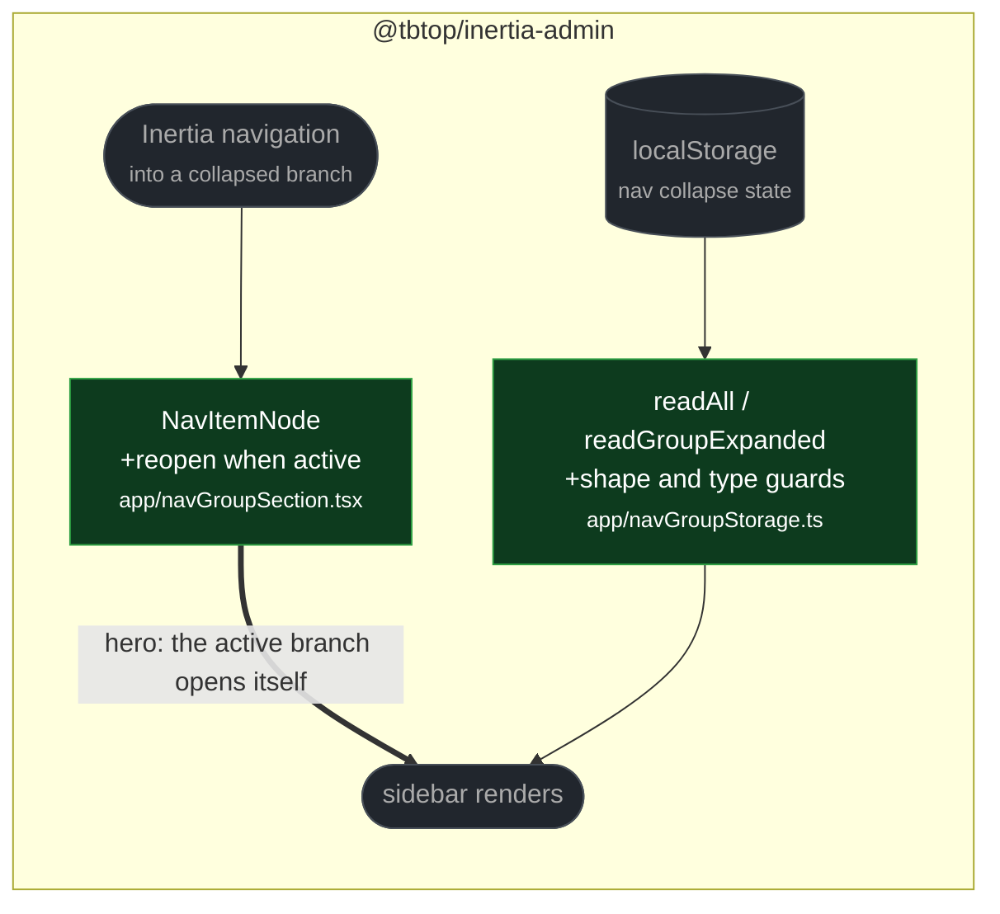

# fix(nav): branch reopening and malformed collapse state

touches: sidebar navigation, nav collapse persistence

**A nested branch stayed shut after navigating into it.** Open state was derived from
`currentUrl` only on first render. The Inertia shell stays mounted across navigations,
so moving into a collapsed branch highlighted the active item while leaving it hidden —
the user had to expand the branch by hand to see where they were.

**A stored `null` crashed the sidebar.** `JSON.parse("null")` succeeds, so `readAll`
returned `null`; `readGroupExpanded` then indexed it *outside* the try/catch and threw
during state initialisation. Contradicts the module's documented best-effort behaviour,
where unreadable persistence is supposed to fall back silently.

**Read by eye:**
- `packages/client/src/app/navGroupSection.tsx`
- `packages/client/src/app/navGroupStorage.ts`

**Verification:**
- Both branches' added tests were run against the merge-base and fail there — the
  storage one takes two tests down, the nav one takes down the reopen case.
- The nav effect keys on the `active` result rather than on every render, so it does
  not fight the user. Probed separately: with the current page inside a branch, a
  manual collapse still closes it and stays closed.
- Composed branch: client 1789 pass / 0 fail, `tsc` clean, PHP 1345 pass, phpstan no
  errors.
