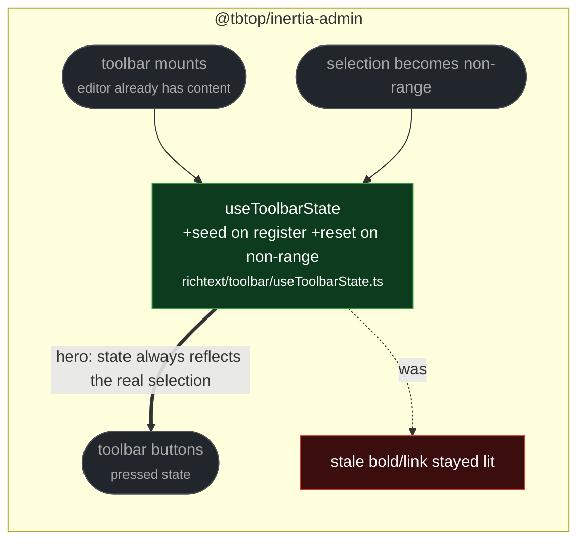

# fix(richtext): reset and seed the toolbar state from the selection

touches: richtext toolbar

Two gaps in one hook. When the selection stopped being a range selection —
clicking an image node, or losing the selection entirely — `updateToolbar` returned
early without replacing state, so bold, link and block-type buttons stayed lit for a
selection that cannot carry any of them. And the hook never read the editor state when
it registered, so a toolbar mounted over already-populated content showed its defaults
until the user's next edit.

**Read by eye:**
- `packages/client/src/fields/richtext/toolbar/useToolbarState.ts`
- `packages/client/src/fields/richtext/toolbar/useToolbarState.test.tsx` (added)

**Verification:**
- This patch shipped **no test**, and the toolbar directory had no coverage at all, so
  a regression test was written rather than merging an unpinned behaviour change. It
  drives the hook against a real Lexical editor: one case asserts it seeds from content
  present at mount, the other that a non-range selection clears the formatting flags.
- Both cases were run with each half of the fix reverted and **fail**; they pass with
  the fix. The test uses `createEditor` from the `lexical` core rather than
  `@lexical/headless`, which is not a dependency here — no new package was added for a
  test.
- Composed branch: client 1795 pass / 0 fail, `tsc` clean, PHP 1345 pass, phpstan no
  errors.
