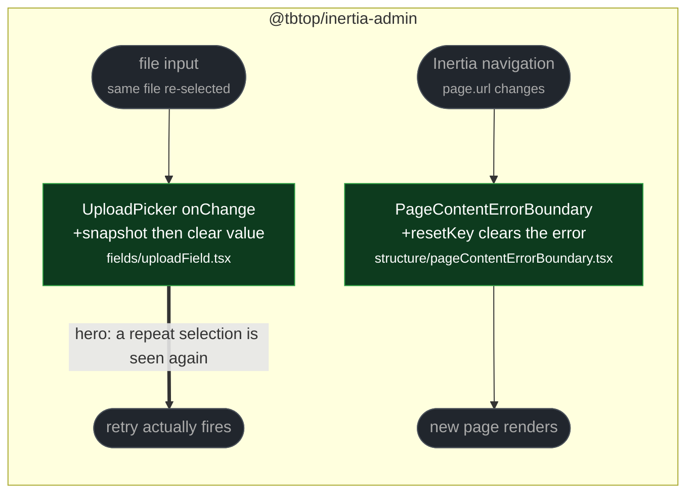

# fix(client, fields): upload retry and error-boundary recovery

touches: upload field, page content error boundary

**A failed upload could not be retried with the same file.** The file input kept its
previous selection, and browsers fire no `change` event when the user picks an
identical file again. After a size-validation or network error the picker sat there
with the file already selected, and re-choosing it did nothing — the user had to pick
a different file or reload. The handler now snapshots `files` into an array and clears
the input's value before doing any async work.

**The page error boundary never recovered.** Once `getDerivedStateFromError` stored an
error, nothing cleared it. An Inertia navigation to a perfectly healthy page kept
rendering the error panel, so the only way out was the full-page reload button.

`onFiles` changes signature from `FileList | null` to `File[]` — a live `FileList`
would be emptied by the reset before the async consumer read it, so the array snapshot
is load-bearing, not a style choice.

`resetKey` is a required prop, which is safe: `PageContentErrorBoundary` has exactly
one caller. It keys on `page.url` rather than on children identity, so a genuinely
crashing page still shows the panel instead of looping.

**Read by eye:**
- `packages/client/src/fields/uploadField.tsx`
- `packages/client/src/structure/pageContentErrorBoundary.tsx`

**Verification:**
- Boundary: added test red on the merge-base, green with the fix.
- Upload: this branch conflicted with the already-merged a11y fix in the same
  `UploadPicker` props block. Resolved by hand as a union — blur/aria props from the
  earlier fix, the `File[]` signature and input reset from this one. Both features
  verified together afterwards: `uploadField` + `uploadMultiField` 28 pass, `tsc`
  clean.
- Whole client suite on the composed branch: 1785 pass / 0 fail.
