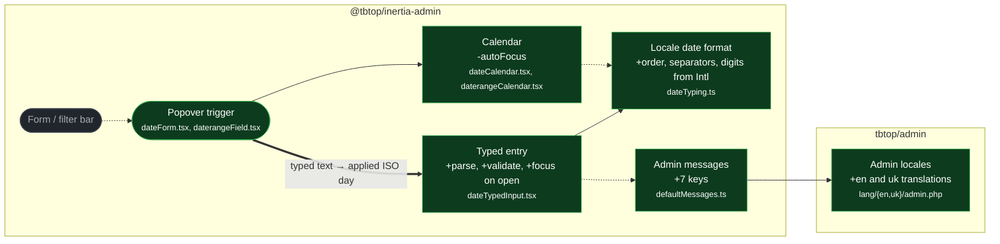

# feat(fields): typed date entry in the date and daterange popovers

touches: typed entry, date field, daterange field, admin messages, admin locales

Base is `HEAD` (b2f9aa5) — the work is uncommitted on a branch cut from it, so the
merge-base with `main` is HEAD itself.

The date and daterange popovers held a calendar and nothing else: a day could only
be clicked, never typed. Both now open with a text input above the calendar, in the
admin locale's numeric format (`05.03.2026` for uk, `03/05/2026` for en), with ISO
`Y-m-d` accepted too for values pasted from the database. Invalid text stays on
screen and marks the field instead of being reverted, and no value leaves the field
until the text parses — a half-typed date never clears the day already stored.

Wiring: `CONTEXT.md` gains *typed entry* and *applied value*; `docs/backlog.md` records
the deferred `Field::format()` override under Fields / forms; `packages/client/package.json`
goes to 0.5.0 — the popover now opens focused on its input rather than the calendar, which
is a visible behaviour change rather than a fix.

The seven new client keys ship with `en` and `uk` translations, which
`ClientLocaleContractTest` requires. They live under `field.date.hint.*` rather than
`field.date.placeholder.*`: `placeholder` is already a leaf string, and `Arr::dot` cannot
flatten a branch and a leaf at the same key.

Two fixes fell out of building this, both reachable before the change:

- The calendars passed `autoFocus`, which day-picker re-asserts on every render. With
  an input in the popover it swallowed every keystroke after the first, so it is gone
  and the popover now focuses its input explicitly on open. Keyboard users still reach
  the grid by Tab.
- Typing only the end bound of a daterange emitted `{from: X, to: X}` — the missing
  start was filled in from the end. A lone bound is now held in the draft for display
  and never emitted as a range.

No wire-grammar change: no new field options, so the schema, the kitchen-sink fixture
and the PHP builders are untouched. Client validation stays UX-only — `isValid` is
still not wired into submit, and PHP remains the validation boundary.

**Read by eye:**
- `packages/client/src/fields/dateTyping.ts`
- `packages/client/src/fields/dateTypedInput.tsx`
- `packages/client/src/fields/dateForm.tsx`
- `packages/client/src/fields/daterangeField.tsx`
- `packages/php/resources/lang/uk/admin.php` (translations only)

**Assumptions:**
- Admin locales resolve to a Gregorian numeric format ICU can lay out; a locale whose
  `formatToParts` omits a date field falls back to ISO order, which no test covers.
