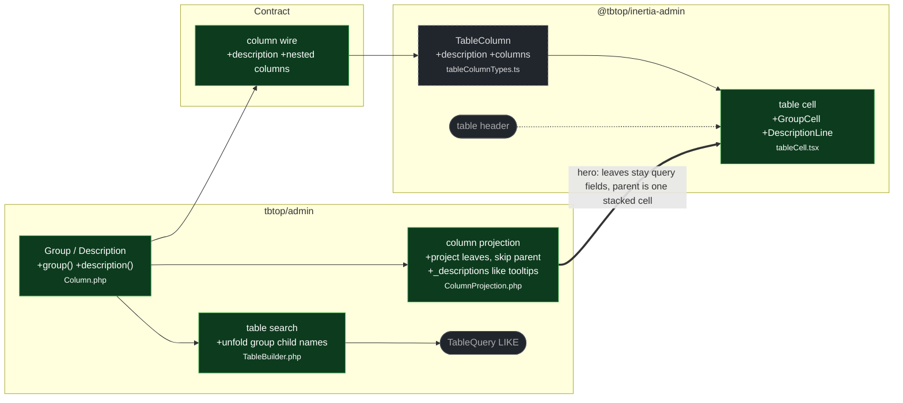

# feat(table): glue leaf columns into one cell and render a muted description

touches: group, description, column wire, column projection, table search, table cell

> ⚠️ **Contract** table column: no `description` / nested `columns` → `description?: string` and recursive `columns` (`$ref` `#/$defs/columns`), paired by `if/then` in both directions: `kind: "group"` requires a non-empty `columns`, and `columns` requires `kind: "group"`.
> ⚠️ **Contract** kitchen-sink: title column gains `description: "Headline"`; new `car` column `kind: "group"` with leaves `car_name` (emphasized) and `car_plate` (muted).

A table column may carry a **description** (static string on the column, or a per-row closure resolved into `row._descriptions`, same shape as tooltip). **Group** is display glue, not a composite value: `Column::group()` sets `kind: "group"` and nested `columns`; projection writes the leaves into the row and never `computeValue`s the parent; the client paints one `<td>` as a vertical stack. Search unfolds child names (or every child, when the parent is searchable). Serialize rejects empty groups, nested groups, editable parent or child, copyable parent, individually-searchable children, and duplicate leaf names vs top-level columns.

Only `searchable()` unfolds into the children today, so the DSL rejects everything it cannot honor rather than dropping it silently. On the parent, `sortable()` and `individuallySearchable()` throw permanently: the parent is not a query field, and `sortableColumnNames()` would otherwise emit `order by "car"` — tolerated by SQLite, a 500 on MySQL/Postgres. On a child, `sortable()` and `translatable()` throw as not-yet, because `sortableColumnNames()`/`translatableColumns()` still walk only top-level columns. Lifting the child restriction later is additive — tracked in DiVotek/tbtop#295.

Wiring: API reference `docs/ai/api/tables.md`, glossary `CONTEXT.md`, tables ADR, kitchen-sink page fixture.

**Read by eye:**
- `packages/contracts/structure.schema.json`
- `packages/contracts/fixtures/kitchen-sink.json`
- `packages/php/src/Http/ColumnProjection.php`
- `packages/client/src/structure/table/tableCell.tsx`
