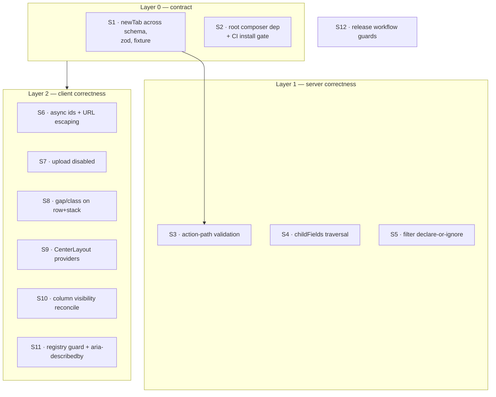

# Confirmed defects from the 2026-08 external audit

Sixteen defects were verified line-by-line against `f73df6a`. The audit itself is
unreliable in places — six of its claims were refuted outright, and in three cases
the cited line range contains the very code the claim calls missing. Only verified
findings appear here; each cites the file that decided it.

Two defects in this set were found during verification and are **not** in the audit
(D13, and the `row` half of D10).

## Decision sheet

### 1. Does the legacy filter fallback get an allowlist, or get deleted? · ⚪ grounded

`TableQuery::applyFilters` has an `else` branch (`TableQuery.php:147-154`) that runs
when a table declares no filter fields: every `filters[...]` request key becomes
`$builder->where($field, $value)` with the column name taken straight from user input.
The `applySort` code directly below it does the opposite — `TableQuery.php:165-170`
allowlists against `sortableColumnNames()` under a comment reading *"Security
whitelist: only allow explicitly declared sortable columns."*

Unknown filter keys are dropped silently and the fallback is removed **(вариант A)**.
Dropping is the same degradation a consumer already sees when a filter is misspelled,
and it needs no new "all queryable columns" introspection helper — no such list exists,
and inventing one to allowlist against is more surface than deleting the branch.

Debate moved this. One attacker argued for deletion on the grounds that nothing
depends on the branch; that is false — `TableHttpTest.php:35-40` passes *because* of
it, querying `?filters[published]=1` against `PostsIndexPage` (`Fixtures/PostsIndexPage.php:20-26`),
which declares no `filters()`. Deletion therefore requires updating that fixture to
declare the filter, which is the correct outcome but must be stated, not discovered.

Criterion, options, provenance

**Criterion**: no request-supplied string reaches `where()` as a column name; a table
that declares no filters ignores filter params instead of querying arbitrary columns.

- **A — declare-or-ignore (chosen).** Delete the `else`; update `PostsIndexPage`
  fixture to declare `published` as a filter field so `TableHttpTest` keeps its
  coverage of the real path. Cost: a consumer relying on an undeclared URL filter
  loses it silently.
- **B — allowlist against known columns.** Requires a new column-introspection
  helper; `sortableColumnNames()` is not a substitute (it lists *declared sortable*
  columns, not queryable ones). More code, same security outcome.
- **C — 422 on undeclared key.** Rejected: breaks bookmarked URLs carrying stale
  params, and no error path exists on this route today.

**Impact is information disclosure, not SQL injection.** Laravel wraps the identifier,
so `filters[id\` OR 1=1 --]` yields a quoted identifier and a "column not found"
error. The reachable attack is a blind oracle: `filters[is_admin]=1` shifts `total`,
letting an attacker confirm values of undeclared columns.

**Client note**: `tableUrlStateHelpers.ts:62-89` `readFilters` parses any `t[name][key]`
out of the URL with no cross-check against declared fields, so a hand-edited URL can
carry undeclared keys today. That is the bookmark case above.

**Provenance**: `TableQuery.php:136-155`, `TableQuery.php:163-177`,
`TableFilterApplier.php:31-41`, `TableHttpTest.php:35-40`, `Fixtures/PostsIndexPage.php:20-26`,
`tableUrlStateHelpers.ts:62-89`.

---

### 2. Does `Field::childFields()` learn to walk `children`, or does `set('children')` become an error? · 🟡 owner

`Node::nestedChildren()` (`Node.php:114-131`) walks both `children` and `fields`, plus
tab bodies. `Field::childFields()` (`Field.php:216-225`) reads only `opts['fields']`.
`RuleWalker` dispatches on type: a `Node` child goes through `nestedChildren()`
(`RuleWalker.php:33-43`), a `Field` child through `childFields()` (`RuleWalker.php:67`).
So subfields attached to a Field via the public `set('children', [...])`
(`Field.php:159-164`, unrestricted writer) render correctly but collect **no rules** —
the input is unvalidated and absent from the `validate()` payload.

`Node.php:105-110` documents this exact class of bug being hit once already, naming
rule collection as the victim. The fix landed on `Node` only.

Traversal is unified so both keys are read in place **(вариант A)**, because the
narrow behaviour is not load-bearing: no production code reaches it. A repo-wide grep
for `set('children'` returns two hits, both in `WhenDslTest.php:294,307`.

Debate moved this twice. One attacker argued the split is deliberate and that unifying
would recurse infinitely through `toNode()`. The recursion is real but only for one
naive implementation — `childFields()` never constructs a Node, so reading both keys
from `opts` in place has no cycle. The same attacker's premise ("Field never stores
`children`") is refuted by the public `set()`. A second attacker raised the migration
risk below, which is why this is an owner decision rather than grounded.

Criterion, options, provenance

**Criterion**: a declared rule on a subfield runs regardless of which child key the
subfield was attached under — or attaching under the wrong key fails loudly.

- **A — unify traversal (chosen).** `childFields()` reads `children` + `fields`.
  Risk: a consumer whose form has silently accepted invalid data now returns 422 with
  no code change on their side. Discovery is a production 422, not a build error.
- **B — reject `set('children')` on a Field.** Throw at build time. Safer discovery
  (deploy-time, not user-facing), but removes a public escape hatch and does not fix
  the asymmetry for any other key.
- **C — both.** Unify, and separately document `fields` as the supported key.

**Owner's call is A vs B**, and it turns on whether `set('children', …)` on a Field is
a supported pattern or an accident. Evidence says accident: zero production usage,
zero documentation, and the two test usages exist only to pin `nestedChildren()`
behaviour. Recommendation is A with a changelog entry naming the pattern, because B
leaves the `collectAttributes` asymmetry (`RuleWalker.php:268` vs `:284`) unfixed.

**Coverage gap that let this survive**: `WhenDslTest.php:284-313` asserts
`nestedChildren()` and `translatable()` agree, but never calls `collectRules()`.

**Provenance**: `Field.php:159-164,216-225`, `Node.php:105-110,114-131`,
`RuleWalker.php:33-43,60-72,268,284`, `WhenDslTest.php:284-313`.

---

### 3. Does the action path get validation only, or validation plus trusted records? · 🟡 owner

`ActionController.php:27` invokes the handler with `ActionCtx::fromRequest($request, …)`.
`ActionCtx::fromRequest` (`ActionCtx.php:25-39`) reads `$request->input('payload')` and
passes `form`, `selection`, and `row` through verbatim. The form path does the opposite
one file over — `FormSubmitController.php:28` calls
`$request->validate($form->collectRules(), [], $form->collectAttributes())` and
constructs the context with `$validated`.

Two distinct defects share this call site. Only the first is settled.

Validation is added to the action path in this spec; trusted record resolution is
carved out **(вариант B)**. Validation is additive — no consumer signature changes,
and `RuleWalker` already exists and is used by `FormBuilder.php:79,85` and
`SelectCreateController.php:34-36`. Trusted `row`/`selection` cannot be additive without
first deciding what `$ctx->row` *means*, and the audit itself marks it BREAKING.

Debate did not move the split; all three attackers reached it independently. It did
surface the reason: `$ctx->row` currently carries the client's full row projection,
including computed columns with no DB counterpart, so a resolver that returns model
attributes is not a drop-in replacement.

Criterion, options, provenance

**Criterion**: declared `->required()`/`->rules()` on an action's modal form are
enforced server-side, and an undeclared key posted in `payload.form` does not reach
the handler.

- **A — both in this spec.** Blocks the safe half on an unanswered contract question.
- **B — validation now, trusted records as a separate owner decision (chosen).**
- **C — neither.** Leaves PHP not acting as the security boundary on this path,
  contradicting the project's own stated rule.

**What the deferred half needs from the owner**, recorded here so it is not lost:
does `$ctx->row` keep meaning "client payload" with a new trusted accessor beside it,
or does it change meaning? A lazy accessor avoids an N+1 on bulk actions; behaviour
when the record vanishes between render and submit must be typed, not an uncaught
throw. Note `params` already has the trust rule this needs — `ActionCtx.php:37` spreads
`$routeParams` last, documented at `:25` as *"Server-derived params; trusted over
client payload."*

**Existing workaround this removes**: `Fixtures/ActionValidationPage.php:29-45` hand-rolls
`Validator::make($ctx->form, …)` inside the handler.

**Provenance**: `ActionController.php:27`, `ActionCtx.php:25-39`,
`FormSubmitController.php:28`, `RuleWalker.php:19`, `ActionBuilder.php:172-179`,
`Fixtures/ActionValidationPage.php:29-45`.

---

### 4. Does the root Composer manifest gain the dependency, or stop existing? · 🟡 owner

`composer.json:18-23` omits `enshrined/svg-sanitize`; `packages/php/composer.json:20`
declares it; `SvgSanitizer.php:5` imports it and `:33` instantiates it. The root file
is what Packagist resolves — `"name": "tbtop/admin"`, PSR-4 mapping into
`packages/php/src/`. The demo consumes the package through a `path` repository, so the
gap is invisible to every check in this repo.

The failure is worse than a missing class. `SvgSanitizer.php:27` reads the file back
from storage *after* it was written, so the throw at `:33` leaves unsanitized bytes on
the public disk — the class docblock at `:8-16` states the design intends fail-closed.

The dependency is added and a root `composer validate && composer install` step joins CI
**(вариант A)**. A packed-consumer smoke gate is deferred: `composer install` at root
already fails on this defect, and it is three lines of YAML against a new job.

Debate moved this. The first attacker proposed deleting the root manifest as duplicate
cruft; that would unpublish `tbtop/admin`. The same attacker's cheaper CI step is
adopted over the packed-artifact gate originally drafted.

Criterion, options, provenance

**Criterion**: a dependency used by `packages/php/src` at runtime but absent from the
published root manifest fails CI.

- **A — add dep + root `composer validate`/`install` in CI (chosen).**
- **B — add dep + packed-consumer smoke (pack, install in clean app, construct the
  sanitizer).** Catches a second class the cheap gate misses: PSR-4 path drift between
  the two manifests, which `composer install` at root cannot see. Deferred, not
  rejected — recorded in side findings.
- **C — delete the root manifest.** Rejected: it is the published artifact.

**Owner's call** is whether B is worth a job now. Recommendation is A, because the
manifests have already drifted in a second field — `composer.json:40`
`minimum-stability: stable` vs `packages/php/composer.json:76` `dev` — and a
sync-check is cheaper than a consumer install for that class.

**Provenance**: `composer.json:18-23,40`, `packages/php/composer.json:20,76`,
`SvgSanitizer.php:5,8-16,27,33`, `ci.yml:29`, `apps/demo/composer.json` path repo.

---

### 5. Do Row and Stack honour `gap`, or does PHP stop accepting it? · ⚪ grounded

`S.php:172,181` accept `gap` on both `stack` and `row` via `assertKnownKeys`, and
serialize it. `builtinLayoutBlocks.tsx:87` hardcodes `gap-4` and ignores `options.gap`;
`:115` hardcodes `gap-2` and drops `options.class` as well — it is a bare string
literal, not a `cn()` call. `GridBlock:142` and `FlexBlock:134` in the same file map
`gap` correctly through the `GAP` table at `:70-82`.

The client honours both options, copying the sibling pattern **(вариант A)**. PHP
already promises these keys through a validated public API; withdrawing them is a
breaking DSL change requiring a schema bump and a contract test, which is strictly more
change than a one-line ternary that already exists twice in the same file.

Debate sharpened the scope: `row` drops `class` too, which the audit did not report.
Both are the same bug in the same block and are fixed together.

Criterion, options, provenance

**Criterion**: a `gap` or `class` value accepted by the PHP builder reaches the DOM;
omitting it renders exactly as today.

- **A — client honours gap and class (chosen).**
- **B — PHP stops accepting `gap` on stack/row.** Breaking, contract-touching, and
  turns a silent no-op into a thrown exception for any consumer already passing it.

**Visual-regression risk, and why it is bounded**: honouring `gap` changes rendering
for any page that passes it. `apps/demo` passes it nowhere (grep: zero hits on a
`gap` key in `apps/demo/app/Admin/`), so the in-repo diff is zero. The two live
consumers cannot be checked from this worktree — this is an **unverified assumption**,
and the changelog must say "stack/row gap is now honoured; audit pages that pass it."
Defaults are unchanged, so a page that never passes `gap` cannot move.

**Provenance**: `S.php:172,181`, `builtinLayoutBlocks.tsx:70-82,87,115,131-137,142`.

---

### 6. Does `newTab` enter the schema alone, or with the zod mirror? · ⚪ trivial

`ActionBuilder.php:88-95` emits `newTab` on a `visit` spec. `structure.schema.json:891-899`
closes that branch with `additionalProperties: false` and does not list it — so any
`->visit($href, newTab: true)` fails schema validation. `grammar.ts:46` omits it too,
but zod strips unknown keys silently rather than throwing.

All three artifacts move together, plus a kitchen-sink node exercising it **(вариант A)**.
The project's own rule requires it: schema and contract test in the same change, never
separate PRs.

Criterion, options, provenance

**Criterion**: `->visit($href, newTab: true)` passes schema validation, survives the
zod parse with `newTab` intact, and is exercised by the fixture.

CI cannot catch a partial fix. The `php` job's `git diff --exit-code -- ../contracts`
(`ci.yml:41`) sees schema+fixture agreement; the `client` job runs `tsc` and `bun test`
independently and would stay green with a stale `grammar.ts` that silently strips
`newTab` — `materializeActions.ts:59,63` would then read `undefined` and new-tab
actions would regress to same-tab navigation with no failing gate.

**Fixture regeneration is mandatory** for this slice: `UPDATE_FIXTURES=1 vendor/bin/pest --filter Contract`,
then review the diff and commit `kitchen-sink.json`. Note `getenv('UPDATE_FIXTURES')`
is truthiness-based, so `UPDATE_FIXTURES=0` also rewrites.

**Provenance**: `ActionBuilder.php:88-95`, `structure.schema.json:891-899`,
`grammar.ts:46`, `materializeActions.ts:59,63`, `ci.yml:41`, `ContractTest.php` fixture writer.

---

### 7. Does the async id round-trip get a safer separator, or disappear? · ⚪ grounded

`asyncOptions.ts:53` sets `ID_SEPARATOR = ""`. `:156` joins `value` with it to build a
`useMemo` key; `:162` splits it back to feed `onLoad(ctxRef.current, ids)` at `:195`.
Joining and splitting on the empty string shatters every multi-character id — `["12","34"]`
becomes four ids, a UUID becomes 36.

The join/split round-trip is removed and the array is kept, with a stable key derived
separately **(вариант A)**. No separator character is provably safe: ids are opaque
strings from consumer tables, so any delimiter can appear inside one. This deletes the
defect class rather than narrowing it, and is net fewer lines.

Debate moved this from the drafted one-character swap. The file already contains the
pattern to copy — `useLabelCache` at `:70-78` keeps non-primitive state in a ref and
compares manually instead of leaning on dep-array identity.

Criterion, options, provenance

**Criterion**: a multi-character id survives the load cycle intact; the effect does not
refire when the value array is recreated with identical contents.

- **A — drop the round-trip (chosen).**
- **B — separator `""` or `" "`.** Narrows the blast radius, leaves the class.

Nothing persisted is involved — `value` is form state; `idsKey` is a memo/effect key
only. `onLoad`'s signature is unchanged, so this is invisible to consumers.

**Affected kinds**: `selectMulti.tsx:67` and `tagsAsync.tsx:21`. Single-value
resolution uses the scalar path at `:94` and is unaffected.

**Provenance**: `asyncOptions.ts:53,70-78,156,162,194-195`, `selectMulti.tsx:67`,
`tagsAsync.tsx:21`.

---

### 8. How do sixteen defects become mergeable slices? · ⚪ grounded

Slices are grouped by review surface, not by defect count. Layer 0 carries the two
contract-touching changes so nothing else races the fixture; the rest are independent.

One merge was proposed in debate and is adopted — the id-separator and URL-template
fixes are the same defect shape (untrusted string interpolated without escaping) in
adjacent client files. Two proposed merges were rejected: `clearBlockRegistry` has no
natural partner, and the column-visibility fix shares a subsystem but no code with
anything else.

Criterion and rejected groupings

**Criterion**: each slice merges alone with green gates and does not break production
by itself.

Rejected: merging D5 (`newTab`) with D2 (`childFields`) — different files, no shared
path. Rejected: merging D13 (column visibility) with the column-key work — different
layers, different languages, no shared code.

`clearBlockRegistry` (`index.ts:59`) is **not** removed from the barrel.
`consumerIsolation.a.test.tsx:3` imports it from `../index` deliberately, to prove the
*public* reset works for consumers; `:7-8` documents that intent. It is a supported
public API, so the fix is a guard against wiping built-ins, not an unexport.

## Verified / Assumed / Owner's choice

**Verified against code** — every defect below carries a file:line trace in the slice
that fixes it: the root manifest gap and its fail-open consequence; the action path
running no validation; `childFields` dropping nested rules; the filter fallback; the id
separator; upload ignoring `disabled` in both variants; `newTab` failing schema
validation; `gap`/`class` dropped by Row and Stack; `CenterLayout` mounting no
`I18nProvider`; `clearBlockRegistry` wiping built-ins; column visibility never
reconciling stored names; `aria-describedby` absent; `fillRowTemplate` unescaped; the
three release-workflow gaps. Also verified: `TableHttpTest.php:35-40` depends on the
filter fallback, and `consumerIsolation.a.test.tsx:3` depends on the public
`clearBlockRegistry`.

**Assumed** — neither live consumer (easycar/crm, cms-tbtop) passes `gap` on `stack`/`row`,
or attaches Field subfields under `children`. Neither repo is reachable from this
worktree; both assumptions are changelog-visible rather than silently relied on. Also
assumed: `apps/demo` browser tests are not a merge gate (they are local-only —
`ci.yml` never runs `apps/demo`), so no slice's acceptance depends on them.

**Owner's choice** — (a) D2: unify traversal versus reject `set('children')`;
(b) D3-deferred: what `$ctx->row` means once a trusted resolver exists; (c) D4: whether
the packed-consumer smoke gate lands now or stays a side finding.

## Plan

`S12` depends on nothing and can merge at any point.

### S1 · `newTab` across schema, zod mirror and fixture — layer 0
- `->visit($href, newTab: true)` serializes and passes `structure.schema.json` validation.
- `actionSpecSchema.parse({type:"visit", href, newTab:true})` returns `newTab` intact
  rather than stripping it.
- `KitchenSinkPage` contains a `newTab` visit action; `kitchen-sink.json` regenerated
  and committed; `git diff --exit-code -- ../contracts` clean.

### S2 · Root Composer dependency and install gate — layer 0
- Root `composer.json` requires `enshrined/svg-sanitize` at the same constraint as
  `packages/php/composer.json:20`.
- CI runs `composer validate` and `composer install` at repo root and fails if either
  does; the step fails on a manifest missing a dependency `packages/php/src` imports.

### S3 · Action-path validation — layer 1 (depends on S1 only for fixture ordering)
- An action whose modal form declares `->required()` returns 422 when that key is
  absent from `payload.form`, instead of reaching the handler.
- A key posted in `payload.form` that no field declares is absent from `$ctx->form`.
- Route params continue to win over client-supplied `params` (existing rule at
  `ActionCtx.php:37` — a regression test, since nothing covers it today).
- `Fixtures/ActionValidationPage.php` no longer hand-rolls `Validator::make`.

### S4 · `childFields` traversal — layer 1
- A rule declared on a subfield attached via `set('children', [...])` is present in
  `collectRules()` output and enforced on submit.
- The same subfield's label appears in `collectAttributes()` output.
- Subfields attached via `->fields([...])` collect exactly as before (no behaviour
  change on the supported path).

### S5 · Filter declare-or-ignore — layer 1
- A request carrying `filters[undeclared]=x` against a table with no declared filter
  fields returns unfiltered results and issues no `where` on that column.
- A request carrying `filters[undeclared]=x` against a table *with* declared filters
  is unaffected (existing `TableFilterApplier` behaviour).
- `Fixtures/PostsIndexPage.php` declares `published` as a filter field so
  `TableHttpTest.php:35-40` covers the declared path rather than the fallback.

### S6 · Async ids and URL-template escaping — layer 2
- A multi-select async field holding two ids of two-plus characters resolves labels for
  both; the ids reaching `onLoad` are the original strings.
- Re-rendering with a new array of identical contents does not refire the load effect.
- A row value containing `/`, `?`, `#` or `&` interpolated into an action URL template
  produces a URL whose path segments are unchanged.

### S7 · Upload `disabled` — layer 2
- A populated single-file upload rendered with `disabled` exposes no working remove
  control; the value cannot be cleared.
- A populated multi-file upload rendered with `disabled` cannot remove an item and
  cannot reorder by drag.
- An enabled upload retains remove and reorder behaviour unchanged.

### S8 · `gap` and `class` on row and stack — layer 2
- `stack` with `gap` renders that gap; without `gap`, renders today's `gap-4`.
- `row` (non-grid) with `gap` renders that gap; without, today's `gap-2`.
- `row` (non-grid) with `class` merges that class into the rendered element.

### S9 · CenterLayout providers — layer 2
- A page with `layout('center')` resolves translations from panel messages rather than
  falling back to `defaultMessages`.
- Locale switching on a center-layout page takes effect.

### S10 · Column-visibility reconciliation — layer 2
- A column added to a table after a user has toggled visibility on that table is
  visible to that user.
- A column removed from a table does not linger in the persisted set.
- A user's existing hidden/shown choices for still-present columns are preserved.

### S11 · Registry guard and error linkage — layer 2
- `clearBlockRegistry()` leaves built-in descriptors resolvable, so a subsequent render
  does not degrade every node to unknown. `consumerIsolation.a.test.tsx` keeps passing
  against the barrel export.
- A field with a validation error exposes that error as its accessible description; a
  field with helper text and no error exposes the helper text.

### S12 · Release workflow guards — independent
- Two concurrent dispatches do not both publish: the second queues rather than
  cancelling, so no run is interrupted between `npm publish` and the tag push.
- A dispatch from a ref other than `main` fails before any publish step.
- The tag-exists check is re-run immediately before the tag push, closing the gap
  between the current check and the push several steps later.

## Side findings — out of scope

- **Packed-consumer smoke gate.** The cheap root `composer install` in S2 cannot see
  PSR-4 path drift between the two manifests (root maps `packages/php/src/`, nested
  maps `src/`). Criterion if picked up: a packed tarball installed in a clean app can
  construct `SvgSanitizer` and render the kitchen-sink fixture.
- **Manifest drift beyond the dependency.** `composer.json:40` sets
  `minimum-stability: stable`; `packages/php/composer.json:76` sets `dev`.
- **`grammar.ts` cites a generator that does not exist.** `grammar.ts:4` names
  `generate.ts` as the source of truth; no such file exists, and the 1104-line
  `structure.schema.json` is the real authority. Criterion: the comment names an
  artifact that exists, or the generator does.
- **Effects drift in the zod mirror.** `grammar.ts:20-30` omits `haltModal` and
  `copyToClipboard`, which exist in PHP, schema, and client runtime. No runtime impact
  today because nothing calls `effectsSchema`. Criterion: `effectsSchema` accepts every
  effect `Effects.php` can emit.
- **`ContractTest` effect list is hand-written.** `ContractTest.php:81-91` enumerates
  effects manually and stops at `closeModal`, so a new effect cannot fail it.
- **`pest --parallel` is not isolation-clean.** Three failures on a parallel run vanish
  serially. Criterion: `--parallel` and serial runs agree.
- **Column `name` conflates DB key, wire key and edit target.** `Column.php:101`;
  `->sortable()` on a dotted relation column emits `orderBy('location.name')` while
  `ColumnProjection.php:88-94` resolves the same dotted name correctly for display.
  Deliberately excluded: the fix is explicit query-column metadata, which is roadmap
  scale, not a defect patch. Criterion if picked up: a sortable dotted column either
  sorts correctly or fails loudly at build time.
- **Trusted `row`/`selection` resolution.** Carved out of D3 above; needs the owner
  decision recorded there before it can be scoped.
